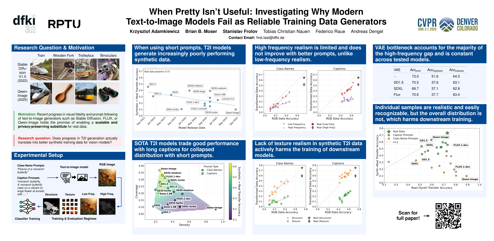

# When Pretty Isn’t Useful: Investigating Why Modern Text-to-Image Models Fail as Reliable Training Data Generators
Source code for "When Pretty Isn’t Useful: Investigating Why Modern Text-to-Image Models Fail as Reliable Training Data Generators" paper (CVPR 2026).  
<p align="center">
    🌐 <a href="https://bill2462.github.io/When-Pretty-Isn-t-Useful-page/" target="_blank">Project</a> | 📃 <a href="https://arxiv.org/abs/2602.19946" target="_blank">Paper</a> <br>
</p>
<p align="center">
    
</p>

___

> **When Pretty Isn’t Useful: Investigating Why Modern Text-to-Image Models Fail as Reliable Training Data Generators**<br>
> Krzysztof Adamkiewicz*, Brian B. Moser*, Stanislav Frolov*, Tobias Christian Nauen, Federico Raue, Andreas Dengel<br>
> <a href="https://arxiv.org/abs/2602.19946" target="_blank">https://arxiv.org/abs/2602.19946 </a> <br>
>
>**Abstract:** 
>Recent text-to-image (T2I) diffusion models produce visually stunning images and demonstrate excellent prompt 
>following. But do they perform well as synthetic vision data generators? In this work, we revisit the promise of
>synthetic data as a scalable substitute for real training sets and uncover a surprising performance regression. We
>generate large-scale synthetic datasets using state-of-the-art T2I models released between 2022 and 2025, train
>standard classifiers solely on this synthetic data, and evaluate them on real test data. Despite observable advances
>in visual fidelity and prompt adherence, classification accuracy on real test data consistently declines with newer
>T2I models as training data generators. Our analysis reveals a hidden trend: These models collapse to a narrow,
>aesthetic-centric distribution that undermines diversity and real data distribution coverage. Overall, our
>findings challenge a growing assumption in vision research, namely that progress in generative realism implies
>progress in data realism. We thus highlight an urgent need to rethink the capabilities of modern T2I models as
>reliable training data generators.
___

## Respository Structure

 - gen -> T2I generation and VAE reencoding code.
 - labelling -> Code for producing SAM3 segmentation masks, depth map and recaptioning of images.
 - object_detection -> Code for training Faster-RCNN model
 - segmentation -> Code for training DeepLabV3 
 - classifier -> Code for training various image classifiers

See README.md in each subdirectory for details on how to use each model.

## Environment

The following packages need to be install
```
conda create -n pretty python=3.12
conda activate pretty
pip3 install torch torchvision diffusers transformers pycocotools
```

## Citation
If you find this useful for your research, please use the following.

```
@inproceedings{adamkiewicz2026pretty,
  title={When Pretty Isn't Useful: Investigating Why Modern Text-to-Image Models Fail as Reliable Training Data Generators},
  author={Adamkiewicz, Krzysztof and Moser, Brian B and Frolov, Stanislav and Nauen, Tobias Christian and Raue, Federico and Dengel, Andreas},
  booktitle={Proceedings of the IEEE/CVF Conference on Computer Vision and Pattern Recognition},
  pages={36660--36669},
  year={2026}
}
```
